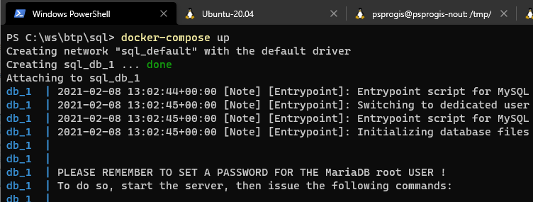
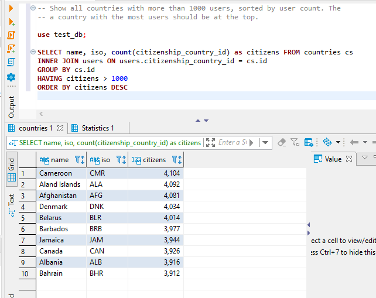

# SQL assignment

## task
Please write an SQL query:
- Table `users` with columns (`id`, `email`, `citizenship_country_id`)
- Table `countries` with columns (`id`, `name`, `iso`)
- Show all countries with more than 1000 users, sorted by user count. The country with the most users should be at the top.

## notes
- it is very unusual that we are using plural names for tables, e.g. "users" or "countries".

## setup
- **start db**. I will use [MariaDB](https://mariadb.com/) in this example, but the query should work with MySQL also (maybe with small updates).
  - you can download and install `MariaDB` or `MySQL` on your desktop, but probably the easiest way is to start an existing docker image.
  - you should have `docker` and `docker-compose` installed on your machine, run the following command at the root of the project:\
    `docker-compose up`\
    it will start `MariaDB` on `localhost`, port `3306`, root password - admin. In the real project, I would create a separate user with specific permissions, but for this test demo, it is ok.\
    Make sure docker daemon (`dockerd`) is running before using `docker-compose` command.
    
- **start client**. There is plenty of clients to connect to a relational database. Some of them have only command-line interface, but in this case, it would be easier to use GUI client - for example [DBeaver](https://dbeaver.io/)
- **create test database**. Run `create-db.sql` script. It will drop `test_db` if it exists and creates the new one.
- **create countries and users tables**. Run script `create-tables.sql`. It will create 2 tables, primary and foreign keys.
- **insert countries**. I will insert only 10 countries for this example. Run script `insert-countries.sql`.
- **insert users**. There are 2 scripts:
  - generate 40000 random users. The script is not perfect and has comments about what should be improved. In the real project I probably would use `mariasql` node module and generate better emails with `faker.js`, even though it will be slower.
  - insert 24 hard-coded users, it can be used for debugging and manual check. Run script `insert-users.sql`.

## query
- run script `query.sql`
  - if you inserted only 24 users - update the condition in the script and replace 1000 with a smaller value, e.g. 3 or 4.
  - you can verify script result for each country and get number of citizens, e.g.:
  `select count(*) from users where citizenship_country_id = <country id here>;`

## info
  - [iso codes](https://www.wikiwand.com/en/List_of_ISO_3166_country_codes)
  - [random names](http://listofrandomnames.com/index.cfm?generated)
